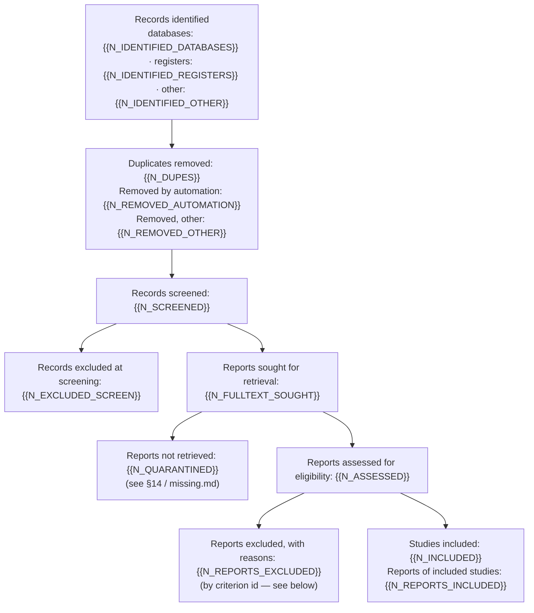

<!-- This file carries the report skeleton in `references/reporting.md` §3 (17 sections, §0-§16).
     Every section must be present; `scripts/verify.py` C-SECTIONS accepts empty-with-a-stated-
     reason but not missing. Do not renumber or fold sections to fit a rigor level — instead
     write "not run at this profile: <reason>" as the section body (see §7 example). -->

# {{TITLE}}

<!-- §0 Title block. The deliverable. Every claim about evidence carries a footnote keyed to an
     evidence_id that was actually retrieved this run (`SKILL.md` "Invariants"). No footnote ->
     the claim does not belong in sections 2-11; if it is your own inference it belongs in §12,
     and nowhere else. -->

> **Status: {{REPORT_STATUS}}.** {{STATUS_NOTE}}
> <!-- e.g. "Provisional: 3 of 28 included studies could not be obtained in full text; see §13." -->

## 1. Plain-language summary

{{PLAIN_LANGUAGE_SUMMARY}}

<!-- <=200 words. GRADE wordings only ("high/moderate/low/very low certainty", not "proven").
     Every sentence must be traceable to §8. Hedge honestly: if the evidence does not answer the
     question, say that first. -->

**Short answer.** {{BOTTOM_LINE}}

## 2. Question and protocol

{{RESEARCH_QUESTION}}

| | |
|---|---|
| Population | {{POPULATION}} |
| Intervention / Exposure | {{INTERVENTION}} |
| Comparator | {{COMPARATOR}} |
| Primary outcomes | {{OUTCOMES_PRIMARY}} |
| Designs eligible | {{DESIGNS}} |
| Timepoint bands | {{TIMEPOINT_BANDS}} |
| Moderators | {{MODERATORS}} |
| Minimal important differences (MIDs) | {{MIDS}} |
| Limits | {{LIMITS_SUMMARY}} |
| Protocol | [`protocol.md`](../protocol.md) |

Inclusion / exclusion criteria: {{CRITERIA_LIST}} <!-- ids I1, I2, ..., E1, E2, ... matching protocol.md -->

Deviations from protocol: {{DEVIATIONS_SUMMARY}} <!-- "none" or a short list pointing at protocol §9 -->

## 3. Methods — search

Sources searched: {{SOURCES}}
Unauthorized/unreachable connectors this session: {{CONNECTORS_UNAVAILABLE}} <!-- e.g. "max run without Scholar Gateway / Consensus: searched a `wide` set only; state what this means for coverage" -->

| Source | Query string | Translated query | Hit count | Executed at |
|---|---|---|---|---|
| {{QUERY_SOURCE}} | {{QUERY_STRING}} | {{QUERY_TRANSLATED}} | {{QUERY_HITS}} | {{QUERY_EXECUTED_AT}} |

<!-- Every query actually run, verbatim and reproducible — link to the search-strategy log if long. -->

## 4. Methods — screening, retrieval, appraisal

Screening design: {{SCREENING_MODE}} <!-- single | dual -->
Dual screening: {{DUAL_SCREEN_NOTE}} <!-- disagreement rate = adjudications / dual-screened; "n/a" for single-screen profiles -->
Acquisition ladder rungs used this run: {{LADDER_RUNGS_USED}}
Appraisal tools by design: {{APPRAISAL_TOOLS_BY_DESIGN}} <!-- e.g. RCT: RoB2, cohort: ROBINS-I, "none": narrative/guideline -->
Models used per stage: {{MODELS_PER_STAGE}}

## 5. PRISMA flow and screening log

<!-- Counter names/order must match the table below exactly (verify.py C-PRISMA checks the table,
     not the diagram — keep them in sync by hand). Regenerate the numbers from `corpus.py prisma`;
     never invent a box. Omit the diagram (keep the table) only if the renderer target for this
     run cannot show mermaid (e.g. a plain-text delivery). -->

| PRISMA 2020 box | Counter | n |
|---|---|---|
| Records identified — databases | `records_identified_databases` | {{N_IDENTIFIED_DATABASES}} |
| Records identified — registers | `records_identified_registers` | {{N_IDENTIFIED_REGISTERS}} |
| Records identified — other | `records_identified_other` | {{N_IDENTIFIED_OTHER}} |
| Duplicates removed | `records_removed_duplicates` | {{N_DUPES}} |
| Removed by automation | `records_removed_automation` | {{N_REMOVED_AUTOMATION}} |
| Removed, other reasons | `records_removed_other` | {{N_REMOVED_OTHER}} |
| Records screened | `records_screened` | {{N_SCREENED}} |
| Records excluded at screening | `records_excluded` | {{N_EXCLUDED_SCREEN}} |
| Reports sought for retrieval | `reports_sought` | {{N_FULLTEXT_SOUGHT}} |
| Reports not retrieved | `reports_not_retrieved` | {{N_QUARANTINED}} |
| Reports assessed for eligibility | `reports_assessed` | {{N_ASSESSED}} |
| Reports excluded, with reasons | `reports_excluded` | {{N_REPORTS_EXCLUDED}} |
| Studies included | `studies_included` | {{N_INCLUDED}} |
| Reports of included studies | `reports_included` | {{N_REPORTS_INCLUDED}} |

Exclusion reasons at full-text stage, by criterion id: {{FULLTEXT_EXCLUSION_REASONS}}

Additional counters: included full text {{INCLUDED_FULLTEXT}}, abstract-only {{INCLUDED_ABSTRACT_ONLY}},
preprints {{INCLUDED_PREPRINTS}}, retracted/EoC flagged {{RETRACTED_FLAGGED}}, quarantined
{{N_QUARANTINED}}, manually supplied via inbox {{MANUAL_INBOX_SUPPLIED}}.

<!-- Counter invariants (verify.py C-PRISMA): records_screened = sum(identified) - sum(removed);
     records_excluded + reports_sought = records_screened; reports_assessed = reports_sought -
     reports_not_retrieved; reports_included <= reports_assessed; quarantined =
     reports_not_retrieved = rows in missing.md. -->

## 6. Characteristics of included studies

{{EVIDENCE_TABLE}}

<!-- Insert templates/evidence-table.md rendered for this run, or link to it if long. -->

## 7. Risk of bias / quality

| Study | Tool | Domain-level judgement | Overall |
|---|---|---|---|
| {{ROB_STUDY}} | {{ROB_TOOL}} | {{ROB_DOMAINS}} | {{ROB_OVERALL}} |

<!-- `tool: "none"` records (narrative/guideline sources) listed with the reason. If this profile
     does not run formal appraisal (e.g. `fast`), state that plainly instead of a table:
     "Not run at this profile (`fast`): no RoB2/ROBINS-I/NOS appraisal was performed; screening
     and eligibility judgments were made directly against protocol.md criteria. See §13." -->

## 8. Results by outcome

<!-- One subsection per outcome, primary outcomes first. Narrative synthesis with effect-
     direction tabulation. Do not pool numerically unless the protocol's analysis plan allowed
     it and the studies are combinable — if you did pool, state the method and the heterogeneity. -->

### 8.1 {{OUTCOME_1_NAME}}

Studies: {{OUTCOME_1_N_STUDIES}} ({{OUTCOME_1_N_PARTICIPANTS}} participants).
Direction: {{OUTCOME_1_DIRECTION_TALLY}} <!-- e.g. "4 favor intervention, 2 null, 1 favors comparator" -->

{{OUTCOME_1_NARRATIVE}}[^{{KEY_A}}][^{{KEY_B}}]

<!-- Include null and negative studies in the narrative with the same weight as positive ones.
     Report effect sizes with CIs, not just significance. -->

### 8.2 {{OUTCOME_2_NAME}}

{{OUTCOME_2_NARRATIVE}}

## 9. Certainty of evidence (GRADE)

| Outcome | Studies (n) | RoB | Inconsistency | Indirectness | Imprecision | Publication bias | Certainty |
|---|---|---|---|---|---|---|---|
| {{GRADE_OUTCOME}} | {{GRADE_N_STUDIES}} | {{GRADE_ROB}} | {{GRADE_INCONSISTENCY}} | {{GRADE_INDIRECTNESS}} | {{GRADE_IMPRECISION}} | {{GRADE_PUBBIAS}} | {{GRADE_CERTAINTY}} |

Reasons for downgrading/upgrading: {{GRADE_FOOTNOTES}}

<!-- If not run at this profile, state that plainly (see §7) instead of an empty table. -->

## 10. Conflicts and inconsistencies

{{CONFLICT_NARRATIVE}}

<!-- Where studies disagree, name the disagreeing studies and explain WHY: population, dose,
     comparator, outcome instrument, follow-up length, analysis model, risk of bias, funding.
     Never average a conflict away and never present a mean of contradictory findings as the
     answer (`SKILL.md` "Invariants"). If the cause of the disagreement is unknown, say
     "unexplained". -->

| Conflict id | Outcome | Concordant studies | Discordant studies | Most plausible explanation |
|---|---|---|---|---|
| {{CONFLICT_ID}} | {{CONFLICT_OUTCOME}} | {{CONFLICT_CONCORDANT}} | {{CONFLICT_DISCORDANT}} | {{CONFLICT_EXPLANATION}} |

## 11. Evidence gaps

<!-- Observations only ("no study reported X"), not explanations. Still evidence-anchored where
     a footnote applies. -->

| Gap | Why it matters | What would close it |
|---|---|---|
| {{GAP}} | {{GAP_WHY}} | {{GAP_STUDY_NEEDED}} |

---

## 12. New insights & hypotheses — NOT EVIDENCE

> **Hard wall.** Everything below this line is generated inference, not a finding of the
> literature. Nothing here is supported by the studies reviewed above; it is what the reviewer
> thinks *might* be true and how it could be tested. Do not cite this section as evidence, do
> not quote it as a conclusion, and do not carry any sentence from it back into sections 1-11.

<!-- Enforced by verifier check C-HYPOTHESIS-WALL. Every item MUST be phrased conditionally
     ("may", "could", "if X then Y would be expected") and MUST carry a testable prediction.
     A hypothesis phrased as an established finding is a verifier failure. Footnotes here point
     to the evidence that PROMPTED the idea; they never make the idea itself evidenced. -->

### H1 — {{HYPOTHESIS_1_TITLE}}

- **Idea (speculative):** {{HYPOTHESIS_1_STATEMENT}}
- **What prompted it:** {{HYPOTHESIS_1_TRIGGER}}[^{{KEY_C}}]
- **Testable prediction:** {{HYPOTHESIS_1_PREDICTION}}
- **How to test it:** {{HYPOTHESIS_1_TEST}}
- **What would falsify it:** {{HYPOTHESIS_1_FALSIFIER}}

### H2 — {{HYPOTHESIS_2_TITLE}}

- **Idea (speculative):** {{HYPOTHESIS_2_STATEMENT}}
- **What prompted it:** {{HYPOTHESIS_2_TRIGGER}}
- **Testable prediction:** {{HYPOTHESIS_2_PREDICTION}}
- **How to test it:** {{HYPOTHESIS_2_TEST}}
- **What would falsify it:** {{HYPOTHESIS_2_FALSIFIER}}

---

## 13. Limitations of this review

<!-- Stated plainly. This section is what separates an honest review from a confident one. -->

- **Full text not obtained ({{N_QUARANTINED}}):** {{QUARANTINED_LIST}} — full detail in §14. These
  studies are excluded from the synthesis; their absence may bias it in the direction of
  {{QUARANTINE_BIAS_DIRECTION}} <!-- or "an unknown direction" -->.
- **Abstract-only evidence ({{N_ABSTRACT_ONLY}}):** {{ABSTRACT_ONLY_LIST}} — conduct could not be
  appraised; every claim resting on these is marked *(abstract only)* in the text above.
- **Scope/rigor tier:** {{PROFILE}} — {{PROFILE_LIMITATIONS}} <!-- e.g. "no dual screening, no
  formal RoB/GRADE appraisal (see §7, §9)" -->
- **Language / database restrictions:** {{LANGUAGE_DB_RESTRICTIONS}}
- **No pooling:** {{POOLING_NOTE}} <!-- state if no meta-analysis was performed and why -->
- **Searched but not found:** {{SEARCHED_NOT_FOUND}} <!-- outcomes, populations or comparisons for
  which the search returned nothing; state that this is absence of evidence, not evidence of
  absence -->
- **Other known limitations:** {{REVIEW_LIMITATIONS}}

## 14. Unobtainable / quarantined evidence

| PMID | DOI | PMCID | Title | Journal | Rung reached | Links |
|---|---|---|---|---|---|---|
| {{Q_PMID}} | {{Q_DOI}} | {{Q_PMCID}} | {{Q_TITLE}} | {{Q_JOURNAL}} | {{Q_RUNG}} | {{Q_LINKS}} |

Resume instructions: PDFs dropped into the run's `inbox/` are ingested on rerun; see
[`missing.md`](../missing.md) for the full per-record detail.

## 15. References

<!-- Markdown footnotes are the per-claim attribution layer (`SKILL.md` "Invariants"). Keys match
     `sources[].id` in the OKF bundle. Every key used above appears here; every entry here is a
     record actually retrieved this run. Uncited included studies are reported by verify.py. -->

[^{{KEY_A}}]: {{AUTHORS_ETAL_A}} {{TITLE_A}}. *{{JOURNAL_A}}* {{YEAR_A}}. PMID {{PMID_A}}. DOI [{{DOI_A}}](https://doi.org/{{DOI_A}}). [PubMed](https://pubmed.ncbi.nlm.nih.gov/{{PMID_A}}/)
[^{{KEY_B}}]: {{AUTHORS_ETAL_B}} {{TITLE_B}}. *{{JOURNAL_B}}* {{YEAR_B}}. PMID {{PMID_B}}. DOI [{{DOI_B}}](https://doi.org/{{DOI_B}}). *(abstract only)*
[^{{KEY_C}}]: {{AUTHORS_ETAL_C}} {{TITLE_C}}. *{{JOURNAL_C}}* {{YEAR_C}}. PMID {{PMID_C}}. DOI [{{DOI_C}}](https://doi.org/{{DOI_C}}).

<!-- Data source attribution (required): literature identified via PubMed
     (https://pubmed.ncbi.nlm.nih.gov/); full text via PMC / Europe PMC / Unpaywall as recorded
     per study in corpus.jsonl. -->

## 16. Provenance

| | |
|---|---|
| Profile | {{PROFILE}} |
| Scope | {{SCOPE}} |
| Rigor | {{RIGOR}} |
| Budgets | {{BUDGETS}} |
| Models per stage | {{MODELS_PER_STAGE}} |
| Script versions | {{SCRIPT_VERSIONS}} |
| Verification summary | {{VERIFICATION_SUMMARY}} <!-- link to outputs/verification.json -->
| OKF promotion status | {{OKF_PROMOTION_STATUS}} |
| Run slug | {{RUN_SLUG}} |

Searched {{SEARCH_DATE}}. Generated by deep-research; run `{{RUN_SLUG}}`.
